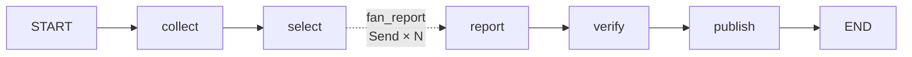

# 오늘의 기념품 — 실행 리포트

매일 아침 대륙이 하나씩 돌아가고, 그 대륙의 국가 하나를 골라
지금 화제인 기념품을 디스코드로 발행하는 뉴스레터 에이전트다.
과제 필수 5단계(수집·선별·요약/인사이트·자동검수·발행)를 전부 포함한다.

첫 발행일(2026-09-15)은 중동 · 아랍에미리트 차례였다.

## 1. 분야 및 독자 정의

- **분야**: 해외여행 기념품 — "이번 여행에 뭘 사올까"에 답하는 발견형(B2C) 뉴스레터.
  그 나라에서 파는もの(아웃바운드)만 다루고, 역직구·인바운드는 다루지 않는다.
- **독자**: 다음 여행을 준비하며 '뭘 사올까'를 고민하는 한국인 여행자.
  면세점과 기본 관광지 쇼핑은 이미 알고, 현지에서만 파는 것을 알고 싶어 한다.
- **분야 선택 배경**: 여행자에게 바로 쓸모가 있고, 품목 하나하나를 원문과 대조해
  검증할 수 있는 주제라서다. 과제의 4단계(자동 검수)를 형식적으로가 아니라
  실제로 작동시킬 수 있다는 점이 선택 이유다.
- **발행 단위**: 기사 1건 = 품목 1개. 기사 5건 선별 → 각 기사의 대표 품목 1개를 헤드라인으로.
- **로테이션**: 아시아 / 유럽 / 아메리카(전체) / 오세아니아 / 아프리카 / 중동이 매일 순환하고,
  한 바퀴 돌 때마다 다음 국가로 넘어간다(날짜만으로 결정되어 재현 가능).
  북미는 나라가 적어 아메리카 전체를 한 칸으로 묶었다.

## 2. 소스 채택표

curl로 직접 실측한 값이다.

### 채택 4

| 소스 | 종류 | 측정값 | 채택 이유 |
|---|---|---|---|
| **Tavily** `/search` | 쿼리형 API | 무료 1,000크레딧/월, **advanced 1호출=2크레딧**(공식 문서 기준, basic은 1) | 국가별 쿼리 + `include_raw_content`로 본문까지 한 번에. 네이버/티스토리 블로그를 잡는다. 실행당 2호출(한·영)이라 4크레딧/회 + 재시도분 |
| **YouTube Data API v3** | 쿼리형 API | 검색 전용 **100회/일** 버킷 | "○○ 기념품 BEST 10"류 하울 영상이 기념품 유행의 1차 소스. 날짜가 전부 온다 |
| **TimeOut** RSS | 고정 피드 | **100건** | 도시 단위 쇼핑·시장 기사. 직접 URL |
| **Atlas Obscura** RSS | 고정 피드 | **27건** | 지역 특산·희귀품. 직접 URL |

### 탈락 6 — 수치가 근거다

| 소스 | 측정값 | 탈락 사유 |
|---|---|---|
| Google News RSS(검색형) | 피드는 살아있음(일본 37 / 페루 8 / 한국어 21건) 그러나 **본문 13자** | 링크가 `news.google.com/rss/articles/CBMi...` JS 리다이렉트. `curl -L`의 `url_effective`가 그대로 google이고 trafilatura가 본문을 못 뽑는다. 제목은 쓸 수 있으나 검수할 원문이 없어 탈락 |
| Reddit `search.rss` | **0건** | 차단됨 |
| Lonely Planet | **0건** | 피드 사망 |
| Bing News RSS | **1건** | 사실상 무응답 |
| GDELT DOC API | **HTTP 429** | 무료 레이트리밋 |
| Wikivoyage API | 전문 반환 O | 날짜가 없어 "지금 유행"을 못 말한다. 품목 사전/폴백으로만 보류 |

과제 금지 소스(OpenAI·DeepMind·TechCrunch·The Verge·MIT TR·AI타임스)는 전부 AI 피드라
이 주제와 안 겹친다. 충돌 없음.

## 3. 선별 로직 설계

- **중요도 기준** (`audience.yaml`): 품목 하나를 보고 예/아니오로 답할 수 있는 5문장.
  지금 실제로 살 수 있는가 / 그 나라·지역에서만 살 수 있는가 /
  캐리어에 넣어 가져올 수 있는가(액체·부패·파손·반입금지 제외) /
  1인 면세한도(미화 800불) 안인가 / 최근에 화제가 된 것인가.
- **버릴 것**: 의약품(약사법상 대리구매 원천 금지) / 주류·담배(반입 수량 제한·별도 과세) /
  정식수입 규제 화장품 / 위조품 / 설명 없는 쇼핑몰 상품 페이지 / 협찬·광고 표기 글.
- **예선·본선 2단계** (`graph.py` `select`): 40건 묶음 예선에서 8건씩 →
  본선에서 목표+여유분(`OVER=3`)을 한 화면에 놓고 고른다.
  정확히 5건만 뽑으면 검수 탈락 한 건에 발행이 미달하기 때문에 초과 선별이 필요하다.
- **상한의 이유**: 소스별 상한 8(수집)·발행 한곳당 3건. 한 곳이 후보를 독점하면
  상대평가가 거기서만 이뤄지기 때문에 코드로 세어서 막는다(프롬프트 부탁이 아니라 카운터로).
  초과 선별분은 `publish()`에서 `[:TARGET]`으로 자른다.
- **국가 핀**: 선별 프롬프트에 오늘의 국가를 박는다.
  그 나라에서 살 수 있는 기념품 기사를 우선하고, 다른 나라·일반론은 고르지 않는다.
  날짜만으로 정해지는 상수라 import 시점에 프롬프트에 끼운다.

## 4. 파이프라인 구조도

- **State(`Brief`)**: `hours / collected / picked / drafted(+operator.add) / verified / log(+operator.add)`.
  `drafted`만 리듀서가 붙는 이유 = 워커가 나눠 채우니까. `verified`는 줄이는 단계라 리듀서 없음.
- **내용과 구조의 분리**: 분야에 따라 달라지는 것은 전부 `audience.yaml`에 있고,
  파이썬에는 구조만 남긴다. 설정 파일이 없으면 바로 멈춘다(기본값으로 도는 것이야말로 조용한 실패).
- **검수 3층** (비용 0인 것부터): ① 품목명 원문 대조(공백 제거 후 문자열 포함.
  단, 원문과 품목명의 문자 체계가 다르면 적용하지 않고 LLM 판정에 위임한다.
  영어 원문에 한글 음역(Souk→소우크, dates→대추야자)이 오면 문자열 대조가
  구조적으로 절대 안 맞아 정상 요약을 환각으로 오판하기 때문이다.
  `number_problems`의 기존 언어 가드와 같은 방식이다) →
  ② 숫자 대조(같은 언어일 때만) → ③ LLM 판정(근거·국가 관련성 두 기준).
  하나라도 걸리면 탈락하고 사유가 로그에 남는다.
  국가 언급 대조층은 제거했다. SYS_CHECK 2번 기준과 중복인데,
  본문이 "두바이"만 쓰고 국가명을 안 쓰면 오탐을 냈다.
- **검수 실패 시**: 탈락시키고 `verified`에서 제외 / `건수`에 미달해도 억지로 채우지 않음 /
  0건이면 `없을때_문구`로 헤드 임베드 1장은 보냄(파이프라인 사망과 구분하기 위해) /
  탈락 사유는 `log` → `metrics.jsonl`에 남는다.
- **발행**: 디스코드 웹훅 + 임베드. 토픽별 색상, footer에 출처·시각(날짜 미확인 표기 포함).
  보낸 URL만 `seen.json`에 기억한다(dry-run은 기억하지 않는다).

## 5. 실행 기록

### 5-1. 디스코드 발행 캡처 (2026-09-15, 중동 · 아랍에미리트)

> 캡처 이미지 삽입 예정 (헤드 임베드 1장 + 품목 임베드 2장, 15:25 실발행)

### 5-2. 깔때기 (`store/metrics.jsonl`)

| run | collected | picked | drafted | published | 비고 |
|---|---|---|---|---|---|
| 12:41 dry | 8 | 2 | 2 | 0 | 키 없이 RSS만. 품목명 대조가 지어낸 이름 2건을 전부 탈락시킴 |
| 14:31 dry | 17 | 3 | 0 | 0 | 키 적용 후 첫 실행. Tavily 스니펫(약 150자)이 전부 본문 미달로 제외 |
| 14:34 dry | 22 | 4 | 2 | 0 | 얇은 본문 trafilatura 폴백 후. 나열형·타국 품목명을 대조가 탈락시킴 |
| 14:35 dry | 22 | 4 | 2 | 2 | 원문 표기 그대로 1품목 지시 후. 통과만 나와서 국가 핀 추가 |
| 14:44 dry | 22 | 3 | 2 | 1 | 국가 게이트 후. 통과 1 + 불합격 1 — 검수가 양쪽으로 동작 |
| 14:49 dry | 22 | 3 | 2 | 1 | FIX Dubai Chocolate 실발행 1건(보냄) |
| 15:08~15:17 dry ×5 | 28→21 | 5~7 | 2~4 | 1~3 | 코드 리뷰 9개 수정 과정. advanced·시간창 8760·일수 365·여유분 적용 |
| 15:24 dry | 21 | 6 | 5 | 4 | 통과·불합격 혼합. 최고 기록 |
| 15:25 **실발행** | 21 | 5 | 4 | **2(보냄)** | 금 환각 1건·블로그 공지 1건 탈락. 같은 풀의 dry-run은 3~4건 |

- 로그 `① 수집`이 0건이 아니고, `④ 검수`의 통과·불합격이 로그에 함께 찍혔다.
- 목표 5건에 실발행 2건이다. 같은 풀의 dry-run에서는 3~4건까지 나왔고, 실행별 분산이 있다.
  검수 기준을 늦춰서 채우지 않고 미달을 받아들인 결과다. 미달 사유는 §6 한계 참조.

## 6. 회고

- **가장 공들인 곳: 품목명 원문 대조 검수.** 기념품 이름은 LLM이 가장 잘 지어내는 항목이다.
  문자열 대조는 비용 0에 오탐이 없고, 실제로 지어낸 품목명("있을리없는품목XYZ" 카나리 포함)과
  나열형 답변을 탈락시켰다. 여기에 언어 가드를 더했다. 영어 원문에 한글 음역이 오면
  문자열 대조가 구조적으로 성립하지 않아 정상 요약을 전량 환각으로 오판한다.
  문자 체계가 다르면 대조를 건너뛰고 LLM 판정에 위임한다.
- **코드 리뷰 9개 수정**: `search_depth="advanced"`(basic은 본문 600자 문턱 통과가 1/9,
  advanced는 10/10) / 초과 선별+`[:TARGET]` 절단 / `Draft.why` 여행자 인사이트로 교체 /
  품목명 언어 가드 / 국가 대조층 제거(SYS_CHECK와 중복 + "두바이"만 쓴 본문 오탐) /
  유튜브 설명글 600자 미만 수집 단계 배제 / 시간창 8760(30일 창은 날짜 있는 소스만 죽인다.
  Tavily는 수집시각으로 채워져 무조건 통과하기 때문이다) /
  Tavily 일수 365(본문 확보 30일 4/10 → 365일 8/10) / 한곳당 3·여유분 3.
- **디버깅에서 발견한 실측 4건**:
  1. Tavily는 같은 질의에 간헐적으로 0건을 준다(동일 요청에 0건/14건, 실행 중에도 재현). 3회 재시도가 들어있다.
  2. Tavily `published_date`는 대체로 비어 있다. 수집시각으로 대체하고 footer에 '날짜 미확인'을 표기한다.
  3. Tavily가 스니펫(150자 안팎)만 줄 때가 있다(이날 UAE 질의에서 `raw_content` 전부 비어 있음 확인).
     얇은 본문은 없는 셈 치고 trafilatura에 한 번 더 맡긴다. 그래도 안 되면 제외가 정상이다.
  4. 유튜브 `search.list`는 검색 전용 100회/일 버킷이라 실행당 1회만 부른다.
- **보완점**: Tavily 날짜 부재(수집시각 대체의 대가 — 시간 필터링을 서버측에 위임하므로 클라이언트 재검증 불가),
  오세아니아 국가 풀 부족(2개국), Wikivoyage 폴백 미구현, 한국어 본문이 도시명만 쓰고 국가명을 안 쓰면
  국가 게이트가 놓친다.

### 솔직하게 적는 한계

- Tavily 항목은 `published_date`가 없어 수집시각으로 대체한다.
- 품목명·국가명 원문 대조는 원문 자체가 틀린 경우는 못 잡는다. 그건 LLM 판정 단계가 담당한다.
- 국가에 따라 후보가 얇다. 이날 UAE는 같은 풀에서도 실행별로 1~4건이 나왔다.
  0건인 날은 `없을때_문구`로 발행된다. 정상 동작이다.
